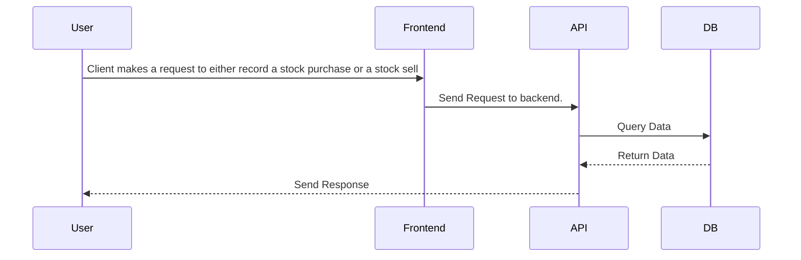

# FamilyTrust

## Sequenzdiagramm

## TODO Liste - Offene Aufgaben und Bugs

### 🔴 Kritische Bugs (Sofort beheben)

#### Backend
- **AdminController komplett nicht funktionsfähig** (`controllers/AdminController.java:16,26,30,36`)
  - Alle Methoden returnen `null` statt tatsächliche Funktionalität
  - Keine Service-Integration
  - Fehlende Authentifizierung/Autorisierung

- **Asset-Präsenz-Logik invertiert** (`services/AssetManagementService.java:206-208`)
  - `isAssetPresent()` returnt `true` wenn Asset NICHT vorhanden ist
  - Führt zu fehlerhafter Kauf/Verkauf-Logik

- **Asset-Balance-Updates funktionieren nicht** (`entities/Asset.java:112-114`)
  - `updateBalance()` Methode ist leer implementiert
  - Account-Balance wird nicht korrekt persistiert

- **Verkaufs-Mengen-Berechnung fehlerhaft** (`services/AssetManagementService.java:147`)
  - Verkaufs-Transaktionen haben negative Mengen (sollten positiv sein)
  - Account-Balance-Updates werden nicht gespeichert

#### Frontend
- **Verkaufs-Funktionalität fehlt komplett** (`views/AccountDetailsView.vue:372-374`)
  - `sellAsset` Funktion nur als TODO implementiert
  - Nutzer können keine Assets verkaufen

- **Debug-Code in Produktion** (`views/PortfolioDashboard.vue:13,20,27`)
  - Debug-Informationen werden mit rotem Text angezeigt
  - Unprofessionelle Darstellung

- **Inkonsistente API-Nutzung** (`components/AssetBuySellForm.vue:25-37`)
  - Direkter axios-Aufruf statt zentraler API-Service
  - Hardcodierte URLs

### 🟡 Wichtige Fehlende Features

#### Backend
- **UserController komplett leer** (`controllers/UserController.java:19-23`)
  - Keine Methoden implementiert
  - User-Management fehlt vollständig

- **Unvollständige Asset-Transaktionstypen** (`services/AssetManagementService.java:74-88`)
  - ETF, Physische Assets, Krypto returnen `null`
  - Nur STOCK_BUY und STOCK_SELL implementiert

- **Fehlende Validierungen**
  - Keine Überprüfung für negative Mengen
  - Keine Validierung für ausreichendes Guthaben
  - Keine Asset-Existenz-Prüfung vor Verkauf

#### Frontend
- **Account-Bearbeitung nicht implementiert** (`views/AccountsView.vue:166-169`)
  - Nutzer können Account-Details nicht ändern
  - `updateAccount` Funktionalität vorhanden aber nicht genutzt

- **Hardcodierte User-ID** (Multiple Dateien)
  - User-ID ist fest auf Test-User gesetzt
  - Kein Authentifizierungssystem

- **Fehlende Fehlerbehandlung**
  - Unzureichende Fehlerbehandlung bei API-Aufrufen
  - Keine Benutzer-freundlichen Fehlermeldungen

### 🟢 Architektur-Verbesserungen

#### Backend
- **Inkonsistente Datentypen**
  - Mix aus `BigDecimal` und `Double` für Geldbeträge
  - Asset-Mengen sollten `BigDecimal` für Präzision verwenden

- **Fehlende Transaktions-Konsistenz**
  - Asset-Transaktionen aktualisieren Account-Balance nicht korrekt
  - Fehlende Rollback-Mechanismen

- **Test-Abdeckung unzureichend**
  - Nur grundlegende Context-Loading-Tests
  - Keine Unit-Tests für Services/Controller
  - Keine Integrationstests

#### Frontend
- **Doppelte Dashboard-Views**
  - `Dashboard.vue` und `PortfolioDashboard.vue` mit ähnlichem Zweck
  - Code-Duplikation

- **Inkonsistente Store-Struktur**
  - `accountStore.js` nicht im `stores/` Verzeichnis
  - Architektur-Inkonsistenz

- **Fehlende TypeScript-Unterstützung**
  - Keine TypeScript-Konfiguration
  - Potenzielle Laufzeitfehler

### 🔵 Fehlende Kern-Features

#### Portfolio-Management
- **Profit/Loss-Berechnungen fehlen**
  - Keine Gewinn/Verlust-Analysen
  - Keine Portfolio-Performance-Metriken

- **Asset-Transaktionshistorie unvollständig**
  - Transaktionen werden geladen aber nicht richtig angezeigt
  - Fehlende Filterung und Aggregation

- **Account-zu-Account-Transfers fehlen**
  - Keine Überweisungen zwischen Accounts
  - Fehlende Transfer-Validierung

#### Benutzerfreundlichkeit
- **Deutsch/Englisch-Mischung**
  - Inkonsistente Sprache in der UI
  - Fehlende Internationalisierung

- **Fehlende Echtzeit-Updates**
  - Keine aktuellen Asset-Preise
  - Fehlende WebSocket/Polling-Integration

- **Unzureichende Formular-Validierung**
  - Minimale Validierung in Formularen
  - Potenzielle Datenintegritätsprobleme

### 🟦 Sicherheits-Verbesserungen

- **API-Konfiguration exponiert**
  - API-Endpoints im Client-Code sichtbar
  - Fehlende umgebungsbasierte Konfiguration

- **Fehler-Informationen preisgegeben**
  - Detaillierte Fehlermeldungen für Nutzer sichtbar
  - Potenzielle Informationsleckage

- **Fehlende Authentifizierung**
  - Keine echte Benutzer-Authentifizierung
  - Autorisierung nicht implementiert

### 📋 Implementierungs-Prioritäten

#### Sofort (Kritisch)
1. `isAssetPresent()` Logik-Inversion beheben
2. Asset-Balance-Updates implementieren
3. Verkaufs-Funktionalität im Frontend implementieren
4. AdminController-Methoden implementieren
5. Debug-Code entfernen

#### Kurzfristig (1-2 Wochen)
1. User-Entity und Management implementieren
2. Asset-Transaktionstypen vervollständigen
3. Umfassende Validierungsschicht hinzufügen
4. Zentrale Fehlerbehandlung implementieren
5. API-Konsistenz verbessern

#### Mittelfristig (1-2 Monate)
1. Portfolio-Analysen implementieren
2. Transaktionshistorie vervollständigen
3. Account-Transfers implementieren
4. Authentifizierungssystem entwickeln
5. TypeScript-Migration

#### Langfristig (3+ Monate)
1. Umfassende Test-Suite entwickeln
2. Echtzeit-Updates implementieren
3. Internationalisierung hinzufügen
4. Barrierefreiheit verbessern
5. Performance-Optimierungen
