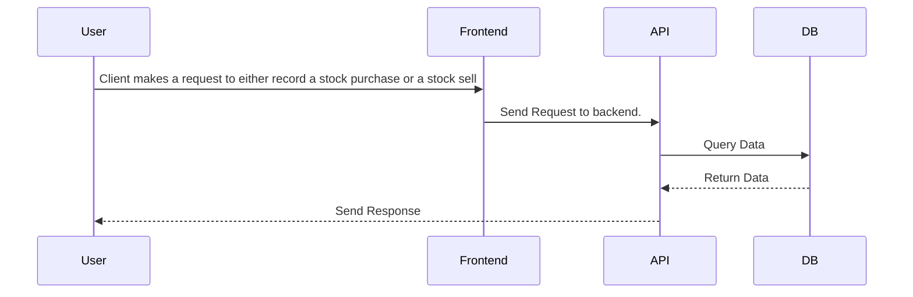

# FamilyTrust

## Sequenzdiagramm



## 📊 PROJEKT STATUS ANALYSE (Stand: 2025-01-06)

### 🎯 **Kernfunktionalitäten Status**
- ✅ **Account Management**: Basis-Funktionen (Erstellen, Löschen, Anzeigen)
- ✅ **Cash Flow Transaktionen**: Einzahlungen, Abhebungen, Dividenden
- ✅ **Asset Kauf**: Grundlegende Aktien-Käufe funktional
- ⚠️ **Asset Verkauf**: Backend fehlerhaft, Frontend nicht implementiert
- ❌ **User Management**: Komplett fehlend
- ❌ **Portfolio Analytics**: Keine Gewinn/Verlust-Berechnungen
- ❌ **Admin Funktionen**: Alle Endpoints returnen `null`

### 🔒 **Security Status**
- ✅ **Keycloak Integration**: OAuth2 Login implementiert
- ⚠️ **Session Management**: Funktional aber verbesserungsfähig
- ❌ **CSRF Protection**: Deaktiviert (Sicherheitsrisiko)
- ❌ **Input Validation**: Nicht implementiert
- ❌ **Authorization**: Keine rollenbasierte Zugriffskontrolle

### 🧪 **Test Coverage**
- ❌ **Unit Tests**: Nur 1 Basis-Test vorhanden
- ❌ **Integration Tests**: Nicht vorhanden
- ❌ **Frontend Tests**: Nicht vorhanden
- ❌ **API Tests**: Minimale HTTP-Test-Dateien

---

## TODO Liste - Offene Aufgaben und Bugs

### 🔴 KRITISCHE SECURITY VULNERABILITIES (SOFORT BEHEBEN)

#### **Authentication & Authorization Lücken**
- **CSRF Protection deaktiviert** (`config/SecurityConfig.java:48`)
  - Anwendung anfällig für Cross-Site Request Forgery Angriffe
  - Risiko: Unbefugte Aktionen im Namen authentifizierter Benutzer

- **Input Validation komplett fehlend** (Alle Controller)
  - Keine Validierung von Benutzereingaben
  - Risiko: SQL Injection, XSS, Data Corruption
  - Betrifft: Account-Erstellung, Asset-Transaktionen, alle API-Endpoints

- **Information Disclosure** (Multiple Dateien)
  - Sensitive Daten in Console-Logs (`AssetManagementService.java:122`)
  - Detaillierte Fehlermeldungen an Frontend-User
  - Risiko: Systemarchitektur-Details preisgegeben

#### **Session & Authentication Issues**
- **Session Hijacking möglich** (`config/SecurityConfig.java`)
  - Keine Session-Timeout-Konfiguration
  - Keine sichere Cookie-Konfiguration
  - Risiko: Unbefugter Zugriff nach Session-Theft

### 🔴 Kritische Functional Bugs (Sofort beheben)

#### Backend
- **AdminController komplett nicht funktionsfähig** (`controllers/AdminController.java:16,26,30,36`)
  - Alle Methoden returnen `null` statt tatsächliche Funktionalität
  - Keine Service-Integration
  - Fehlende Authentifizierung/Autorisierung

- **Asset-Präsenz-Logik invertiert** (`services/AssetManagementService.java:206-208`)
  - `isAssetPresent()` returnt `true` wenn Asset NICHT vorhanden ist
  - Führt zu fehlerhafter Kauf/Verkauf-Logik

- **Account Balance Persistence Bug** (`services/AssetManagementService.java:151`)
  - `account.getAvailableMoney().add()` persistiert nicht
  - Führt zu falschen Account-Balances und Portfolio-Werten
  - **Kritisch**: Finanzielle Daten inkonsistent

- **Asset Balance Updates defekt** (`entities/Asset.java:112-114`)
  - `updateBalance()` Methode ist leer implementiert
  - Asset-Balances werden nie aktualisiert
  - **Kritisch**: Portfolio-Werte komplett falsch

- **Verkaufs-Transaktionen fehlerhaft** (`services/AssetManagementService.java:147-151`)
  - Negative Mengen in Sell-Transaktionen
  - Account-Balance-Updates werden nicht gespeichert
  - **Kritisch**: Verkäufe funktionieren nicht korrekt

#### Frontend
- **Verkaufs-Funktionalität fehlt komplett** (`views/AccountDetailsView.vue:372-374`)
  - `sellAsset` Funktion nur als TODO implementiert
  - Nutzer können keine Assets verkaufen

- **Debug-Code in Produktion** (`views/PortfolioDashboard.vue:13,20,27`)
  - Debug-Informationen werden mit rotem Text angezeigt
  - Unprofessionelle Darstellung

- **Inkonsistente API-Nutzung** (`components/AssetBuySellForm.vue:25-37`)
  - Direkter axios-Aufruf statt zentraler API-Service
  - Hardcodierte URLs

### 🔴 KRITISCHE ARCHITEKTUR-PROBLEME

#### **Database Design Issues**
- **Keine User Entity** 
  - Multi-User-System nicht implementiert
  - Hardcodierte Test-User-ID verwendet
  - **Kritisch**: Produktions-untauglich

- **Fehlende Transaktions-Integrität**
  - Keine proper Transaction Boundaries
  - Asset + Account Updates nicht atomisch
  - **Kritisch**: Data Corruption bei Concurrent Access

- **Inkonsistente Datentypen**
  - Mix von `BigDecimal` und `Double` für Geldbeträge
  - **Kritisch**: Precision Loss in finanziellen Berechnungen

### 🟡 WICHTIGE SECURITY VERBESSERUNGEN ERFORDERLICH

#### **Authorization & Access Control**
- **Keine rollenbasierte Autorisierung**
  - Alle authentifizierten User haben gleiche Rechte
  - Keine Admin/User-Unterscheidung
  - Risiko: Privilege Escalation

- **Missing API Endpoint Protection**
  - Keine Method-Level Security
  - Fehlende @PreAuthorize Annotations
  - Risiko: Unberechtigter Datenzugriff

### 🟡 Wichtige Fehlende Features

#### Backend
- **UserController komplett leer** (`controllers/UserController.java:19-23`)
  - Keine Methoden implementiert
  - User-Management fehlt vollständig

- **Unvollständige Asset-Transaktionstypen** (`services/AssetManagementService.java:74-88`)
  - ETF, Physische Assets, Krypto returnen `null`
  - Nur STOCK_BUY und STOCK_SELL implementiert

- **Fehlende Validierungen**
  - Keine Überprüfung für negative Mengen
  - Keine Validierung für ausreichendes Guthaben
  - Keine Asset-Existenz-Prüfung vor Verkauf

#### Frontend
- **Account-Bearbeitung nicht implementiert** (`views/AccountsView.vue:166-169`)
  - Nutzer können Account-Details nicht ändern
  - `updateAccount` Funktionalität vorhanden aber nicht genutzt

- **Hardcodierte User-ID** (Multiple Dateien)
  - User-ID ist fest auf Test-User gesetzt
  - Kein Authentifizierungssystem

- **Fehlende Fehlerbehandlung**
  - Unzureichende Fehlerbehandlung bei API-Aufrufen
  - Keine Benutzer-freundlichen Fehlermeldungen

### 🟢 Architektur-Verbesserungen

#### Backend
- **Inkonsistente Datentypen**
  - Mix aus `BigDecimal` und `Double` für Geldbeträge
  - Asset-Mengen sollten `BigDecimal` für Präzision verwenden

- **Fehlende Transaktions-Konsistenz**
  - Asset-Transaktionen aktualisieren Account-Balance nicht korrekt
  - Fehlende Rollback-Mechanismen

- **Test-Abdeckung unzureichend**
  - Nur grundlegende Context-Loading-Tests
  - Keine Unit-Tests für Services/Controller
  - Keine Integrationstests

#### Frontend
- **Doppelte Dashboard-Views**
  - `Dashboard.vue` und `PortfolioDashboard.vue` mit ähnlichem Zweck
  - Code-Duplikation

- **Inkonsistente Store-Struktur**
  - `accountStore.js` nicht im `stores/` Verzeichnis
  - Architektur-Inkonsistenz

- **Fehlende TypeScript-Unterstützung**
  - Keine TypeScript-Konfiguration
  - Potenzielle Laufzeitfehler

### 🟡 PERFORMANCE & SCALABILITY ISSUES

#### **Database Performance Problems**
- **N+1 Query Problems**
  - Asset Loading nicht optimiert
  - Multiple DB-Calls für Related Data
  - Impact: Schlechte Performance bei vielen Assets

- **Keine Caching Strategy**
  - Repeated Database Queries
  - Static Data wird immer neu geladen
  - Impact: Unnötige Server-Last

#### **Frontend Performance Issues**
- **Keine Lazy Loading**
  - Alle Account-Daten werden upfront geladen
  - Impact: Langsame Initial Page Load

### 🔵 Fehlende Kern-Features

#### **Complete Missing Core Systems**
- **User Management System fehlt komplett**
  - Keine User Registration/Profile
  - Keine User-spezifischen Permissions
  - **Impact**: System ist Single-User nur

- **Asset Selling System dysfunktional**
  - Frontend Sell-Button nicht implementiert
  - Backend Sell-Logic fehlerhaft
  - **Impact**: Core Portfolio-Feature nicht nutzbar

#### Portfolio-Management
- **Profit/Loss-Berechnungen fehlen**
  - Keine Gewinn/Verlust-Analysen
  - Keine Portfolio-Performance-Metriken

- **Asset-Transaktionshistorie unvollständig**
  - Transaktionen werden geladen aber nicht richtig angezeigt
  - Fehlende Filterung und Aggregation

- **Account-zu-Account-Transfers fehlen**
  - Keine Überweisungen zwischen Accounts
  - Fehlende Transfer-Validierung

#### Benutzerfreundlichkeit
- **Deutsch/Englisch-Mischung**
  - Inkonsistente Sprache in der UI
  - Fehlende Internationalisierung

- **Fehlende Echtzeit-Updates**
  - Keine aktuellen Asset-Preise
  - Fehlende WebSocket/Polling-Integration

- **Unzureichende Formular-Validierung**
  - Minimale Validierung in Formularen
  - Potenzielle Datenintegritätsprobleme

### 🟦 Sicherheits-Verbesserungen

- **API-Konfiguration exponiert**
  - API-Endpoints im Client-Code sichtbar
  - Fehlende umgebungsbasierte Konfiguration

- **Fehler-Informationen preisgegeben**
  - Detaillierte Fehlermeldungen für Nutzer sichtbar
  - Potenzielle Informationsleckage

- **Fehlende Authentifizierung**
  - Keine echte Benutzer-Authentifizierung
  - Autorisierung nicht implementiert

### 🚨 BUSINESS IMPACT ASSESSMENT

#### **Revenue Impact (Hoch)**
- **Asset Selling nicht funktional** → Kunde können Gewinne nicht realisieren
- **Portfolio Analytics fehlen** → Keine Investment-Entscheidungsgrundlage
- **Multi-User System fehlt** → Nicht skalierbar für Familien

#### **Security Risk (Kritisch)**
- **CSRF Attacks möglich** → Finanzielle Transaktionen gefährdet  
- **Data Injection möglich** → Komplette Datenbankgefährdung
- **Session Hijacking möglich** → Unbefugter Account-Zugriff

#### **Operational Risk (Hoch)**
- **Data Corruption durch Race Conditions** → Falsche Finanz-Daten
- **No Rollback Mechanisms** → Unumkehrbare Datenverluste
- **Missing Monitoring** → Probleme unentdeckt

---

## 🎯 ACTION PLAN & IMPLEMENTIERUNGS-PRIORITÄTEN

### 📋 Implementierungs-Prioritäten

#### 🚨 SECURITY EMERGENCY FIXES (Heute)
1. **CSRF Protection aktivieren** (`SecurityConfig.java`)
   ```java
   .csrf(csrf -> csrf.csrfTokenRepository(CookieCsrfTokenRepository.withHttpOnlyFalse()))
   ```
2. **Input Validation hinzufügen** (Alle Controllers)
   ```java
   @Valid @RequestBody CreateAccountRequest request
   ```
3. **Sensitive Logging entfernen** (Alle `System.out.println` mit Financial Data)

#### 🔴 CRITICAL BUG FIXES (Diese Woche)
1. `isAssetPresent()` Logik-Inversion beheben
2. Asset-Balance-Updates implementieren
3. Verkaufs-Funktionalität im Frontend implementieren
4. **Account Balance Persistence Fix** (`AssetManagementService.java:151`)
   ```java
   account.setAvailableMoney(account.getAvailableMoney().add(amount));
   accountRepository.save(account); // ADD THIS
   ```
5. **AdminController Methoden implementieren** (Alle `return null;` ersetzen)
6. **Asset Balance Updates implementieren** (`Asset.java:112-114`)
7. **Frontend Sell Functionality** (`AccountDetailsView.vue:372-374`)

#### 🟡 ESSENTIAL FEATURES (1-2 Wochen)
1. User-Entity und Management implementieren
2. Asset-Transaktionstypen vervollständigen
3. Umfassende Validierungsschicht hinzufügen
4. Zentrale Fehlerbehandlung implementieren
5. **User Management System** (Complete User Entity + Controller)
6. **Method-Level Security** (Add @PreAuthorize annotations)
7. **Transaction Boundaries** (Add @Transactional properly)
8. **Basic Test Coverage** (Unit Tests für Services)

#### 🔵 BUSINESS VALUE FEATURES (1-2 Monate)
1. Portfolio-Analysen implementieren
2. Transaktionshistorie vervollständigen
3. Account-Transfers implementieren
4. Authentifizierungssystem entwickeln
5. **Real-time Price Integration** (External API für Asset Prices)
6. **Advanced Portfolio Analytics** (ROI, Performance Tracking)
7. **Multi-Asset Support** (ETF, Crypto, Physical Assets completion)

#### 🟢 ENHANCEMENT FEATURES (3+ Monate)
1. Umfassende Test-Suite entwickeln
2. Echtzeit-Updates implementieren
3. Internationalisierung hinzufügen
4. Barrierefreiheit verbessern
5. **Performance Optimization** (Caching, Lazy Loading)
6. **Advanced Security Features** (2FA, Audit Logging)
7. **Mobile App Development**

---

## 📈 ERFOLGSMESSUNG & KPIs

### **Security KPIs**
- ✅ CSRF Protection: Aktiviert
- ✅ Input Validation: 100% Coverage
- ✅ Auth/Authorization: Role-based implementiert
- ✅ Sensitive Data: Keine Logs

### **Functionality KPIs** 
- ✅ Asset Selling: Vollständig funktional
- ✅ Account Balances: Immer korrekt
- ✅ Admin Functions: Alle implementiert
- ✅ User Management: Multi-User Support

### **Quality KPIs**
- ✅ Test Coverage: >80%
- ✅ Bug Count: <5 bekannte Bugs
- ✅ Performance: <2s Page Load
- ✅ Availability: >99.5%

**FAZIT**: FamilyTrust hat solide Basis, benötigt aber sofortige Security-Fixes und kritische Bug-Behebungen vor Production-Deployment.
