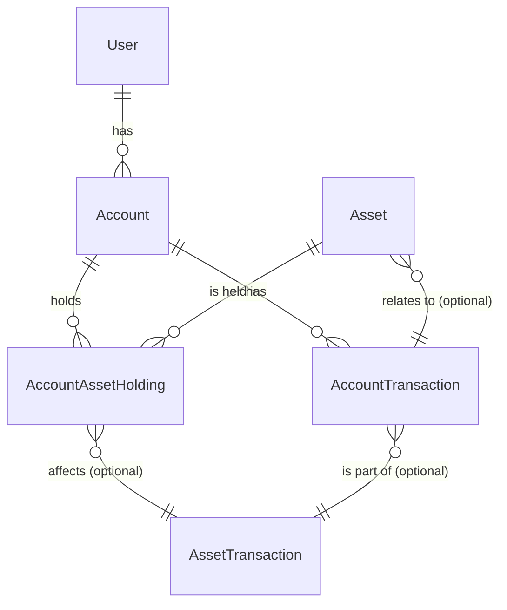

# Application Documentation

With this app, you can manage multiple bank accounts. For each bank account, you can record deposits, stock and ETF purchases and sales, as well as purchases and sales of cryptocurrencies, gold, and silver.

Each user can create a user account that they can use to log in. Bank accounts can be shared, allowing them to be managed by multiple users within a household, business, or project.

The application also allows you to record dividend payments and money withdrawals, i.e., debits from an account.

Stocks and ETFs can be assigned dividend payment dates. Additionally, recurring deposits can be set up, eliminating the need to handle them manually each time.

The application is structured as follows:
- Backend: Java Spring Boot
- Frontend: VueJs
- Database: Postgres
- Logging: Logstash
- Monitoring: Prometheus
- Authentication Service: Keycloak with OAuth2
- Containerization: Docker

If you have any question or feedback, please feel free to contact me.
alejandro.r.laneri@gmail.com

Database Relations
# Datenbank-Schema für Finanz-Tracking-App

Dies ist eine visuelle Darstellung des Datenbank-Schemas für die Finanz-Tracking-App, basierend auf den diskutierten Entitäten und ihren Beziehungen.

## Überblick der Entitäten

### 1. User
Repräsentiert den Benutzer der Anwendung, verknüpft mit Keycloak.

| Attribut       | Typ        | Beschreibung                                   |
| :------------- | :--------- | :--------------------------------------------- |
| `id`           | `UUID`     | Primärschlüssel, eindeutige ID des Benutzers  |
| `keycloak_uuid`| `UUID`     | Verweis auf die Benutzer-ID in Keycloak        |
| `email`        | `String`   | E-Mail-Adresse des Benutzers                  |
| `first_name`   | `String`   | Vorname des Benutzers                         |
| `last_name`    | `String`   | Nachname des Benutzers                        |
| `created_at`   | `DateTime` | Zeitpunkt der Erstellung                     |

### 2. Account
Ein Finanzkonto, das einem Benutzer gehört und Vermögenswerte (Bargeld, Assets) hält.

| Attribut       | Typ        | Beschreibung                                   |
| :------------- | :--------- | :--------------------------------------------- |
| `id`           | `UUID`     | Primärschlüssel, eindeutige ID des Kontos     |
| `user_id`      | `UUID`     | Fremdschlüssel zu `User`                      |
| `name`         | `String`   | Name des Kontos (z.B. "Mein Depot Commerzbank") |
| `current_balance`| `Decimal`  | Aktueller Bargeldbestand des Kontos           |
| `currency`     | `String`   | Währung des Kontos (z.B. "EUR", "USD")         |

### 3. Asset
Definition eines handelbaren Vermögenswerts (z.B. Aktie, ETF, Kryptowährung).

| Attribut       | Typ        | Beschreibung                                   |
| :------------- | :--------- | :--------------------------------------------- |
| `id`           | `UUID`     | Primärschlüssel, eindeutige ID des Assets     |
| `name`         | `String`   | Voller Name des Assets (z.B. "Apple Inc.")   |
| `symbol`       | `String`   | Börsensymbol (z.B. "AAPL", "BTC")             |
| `asset_type`   | `Enum`     | Typ des Assets (`STOCK`, `ETF`, `CRYPTO`, `PHYSICAL`) |
| `isin`         | `String`   | ISIN-Nummer (falls zutreffend)                 |
| `currency`     | `String`   | Primäre Handelswährung des Assets             |

### 4. AccountAssetHolding
Stellt den Besitz einer bestimmten Menge eines Assets in einem spezifischen Konto dar.

| Attribut           | Typ        | Beschreibung                                   |
| :----------------- | :--------- | :--------------------------------------------- |
| `id`               | `Long`     | Primärschlüssel                               |
| `account_id`       | `UUID`     | Fremdschlüssel zu `Account`                   |
| `asset_id`         | `UUID`     | Fremdschlüssel zu `Asset`                     |
| `quantity`         | `Decimal`  | Anzahl der gehaltenen Einheiten des Assets    |
| `average_cost_basis`| `Decimal`  | Durchschnittlicher Einkaufspreis pro Einheit  |

### 5. AccountTransaction
Dokumentiert alle Cashflow-bezogenen Transaktionen auf einem Konto.

| Attribut           | Typ        | Beschreibung                                   |
| :----------------- | :--------- | :--------------------------------------------- |
| `id`               | `Long`     | Primärschlüssel                               |
| `account_id`       | `UUID`     | Fremdschlüssel zu `Account`                   |
| `type`             | `Enum`     | Typ der Transaktion (`DEPOSIT`, `WITHDRAWAL`, `DIVIDEND_CASH`, `ASSET_BUY`, `ASSET_SELL`, etc.) |
| `amount`           | `Decimal`  | Betrag der Transaktion (positiv/negativ)       |
| `description`      | `String`   | Kurze Beschreibung der Transaktion            |
| `transaction_date` | `DateTime` | Zeitpunkt der Transaktion                     |
| `asset_id`         | `UUID`     | Optional: Fremdschlüssel zu `Asset` (für Dividenden, Asset-bezogene Gebühren) |
| `quantity`         | `Decimal`  | Optional: Menge des Assets bei Kauf/Verkauf (kann hier sein oder in `AssetTransaction` wenn detaillierter) |
| `price_per_unit`   | `Decimal`  | Optional: Preis pro Einheit bei Kauf/Verkauf |

### 6. AssetTransaction (Optional, für detaillierte Asset-Bewegungen)
Dokumentiert spezifische Bewegungen von Asset-Mengen, oft im Kontext eines Kaufes oder Verkaufs.

| Attribut           | Typ        | Beschreibung                                   |
| :----------------- | :--------- | :--------------------------------------------- |
| `id`               | `Long`     | Primärschlüssel                               |
| `account_asset_holding_id` | `Long` | Fremdschlüssel zu `AccountAssetHolding` (welche Position betroffen ist) |
| `account_transaction_id` | `Long` | Fremdschlüssel zu `AccountTransaction` (für die Cashflow-Seite) |
| `type`             | `Enum`     | Typ der Asset-Bewegung (`BUY`, `SELL`, `STOCK_SPLIT`, etc.) |
| `quantity_change`  | `Decimal`  | Änderung der Menge des Assets (positiv/negativ) |
| `price_per_unit`   | `Decimal`  | Preis pro Einheit bei der Bewegung           |
| `transaction_date` | `DateTime` | Zeitpunkt der Bewegung                        |

## Beziehungen (Kardinalität)

### TODO

    [] Implement buy asset functionality
    [] Implement sell asset functionality 
    [] Implement list account functionlity in json format
    [] Implement show portfolio evolution functionality
    [] Implement profit/loss per asset functionality 
    [] Implement transfair money from one account to another functionality
    [] Implement create document with portfolio statistic functionality
    [] Implement keycloak functionalities
    [] Implement recurent payment functionality
    [] Implement list asset per account functionality
    [] Implement list asset transaction functionality 
    [] Implement list overall account per user statistic
    [] Implement pagination for account transactions
